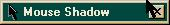



## Mouse Shadow v2\.0

### Description

This draws the shadow of the mouse cursor continuously. This is worth looking at if you want to learn how to skin forms. As you move the mouse around the screen, it always has a shadow. While this program does not skin a form and use that as the shadow, it does merge two bitmaps to prevent flicker and keep as much of the background as possible, current. There is one problem with this code : it won't detect the cursor changing over another program. Any suggestions on how to fix this would be greatly appreciated. Hopefully for the next version, I'll skin a form in the shape of a cursor and follow it around. Votes, suggestions and any feedback at all are very welcome.
 
### More Info
 

             |
---                |---
**Submitted On**   |2001-12-31 23:29:34
**By**             |[Eric O'Sullivan](https://github.com/Planet-Source-Code/PSCIndex/blob/master/ByAuthor/eric-o-sullivan.md)
**Level**          |Advanced
**User Rating**    |5.0 (10 globes from 2 users)
**Compatibility**  |VB 5\.0, VB 6\.0
**Category**       |[Graphics](https://github.com/Planet-Source-Code/PSCIndex/blob/master/ByCategory/graphics__1-46.md)
**World**          |[Visual Basic](https://github.com/Planet-Source-Code/PSCIndex/blob/master/ByWorld/visual-basic.md)
**Archive File**   |[Mouse\_Shad4538812312001\.zip](https://github.com/Planet-Source-Code/eric-o-sullivan-mouse-shadow-v2-0__1-30253/archive/master.zip)

